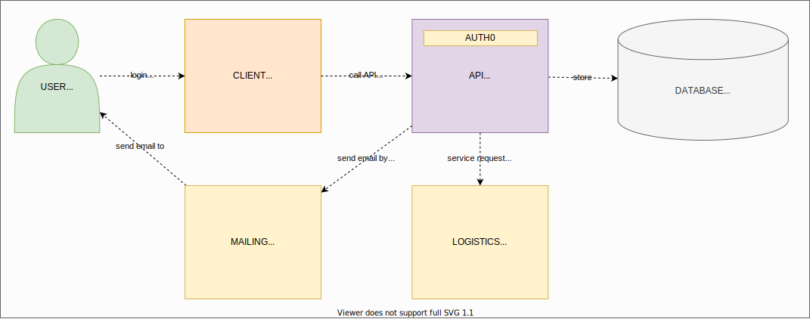
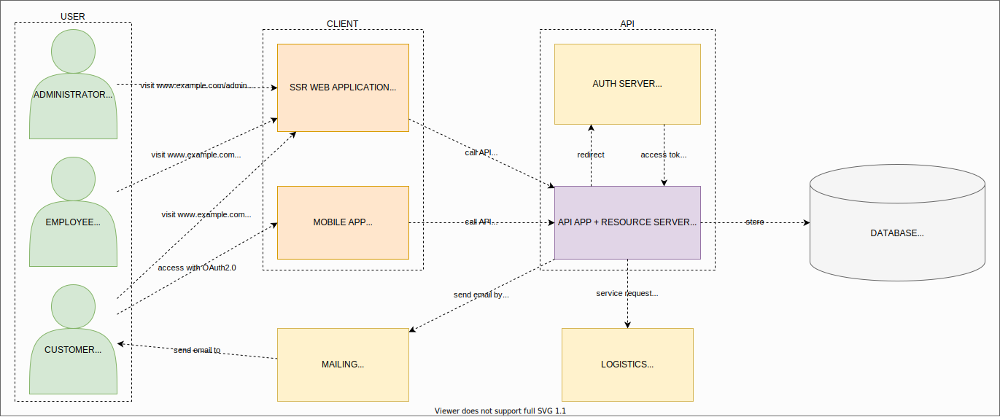
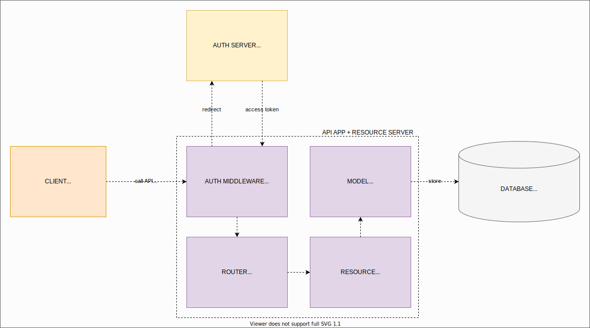
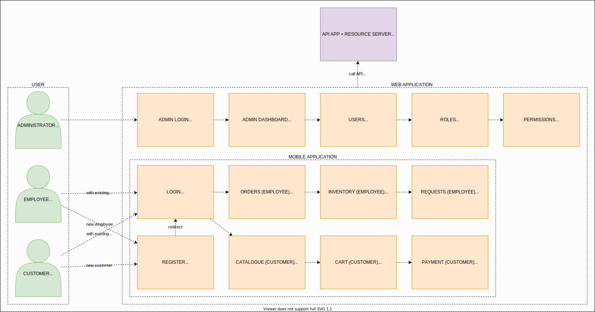

# Architectural Challenge #1 

By: [G.A.JAGUAR](https://github.com/gajaguar)

## Description

Realize an online store system for a business dedicated to antiquities selling.
The solution must consider the following features:

- New requests cration.
- Customer profile and purchase history.
- Inventory management.
- Home delvery management.

Desing one or more diagrams to modelling new system architecture by showing the
selected components and their interaction between itselves starting from next
elements:

- Web sites or applications.
- Internal services or third-party ones (supplier APIs).
- Databases.
- Networks and servers (on premise or cloud).
- Security mechanisms.

## Solution

### Core Diagrams

#### Stage 1 - Context

#### Stage 2 - Container

#### Stage 3 - Components

##### API

##### Client

### Database

#### Tables

- `orders`
  - `order_id`
  - `client_id`
  - `order_date`
- `permissions`
  - `permission_id`
  - `permission_name`
- `products`
  - `product_id`
  - `product_name`
  - `prduct_description`
  - `product_quantity`
- `requests`
  - `request_id`
  - `supplier_id`
  - `request_status_id`
  - `request_date`
- `request_statuses`
  - `request_status_id`
  - `request_status_name`
- `roles`
  - `role_id`
  - `role_name`
- `shipments`
  - `shipment_id`
  - `order_id`
  - `shipment_status_id`
  - `shipment_date`
- `suppliers`
  - `supplier_id`
  - `supplier_name`
  - `supplier_address`
  - `supplier_email`
  - `supplier_phone`
- `users`
  - `user_id`
  - `role_id`
  - `user_email`
  - `user_password`
  - `user_first_name`
  - `user_last_name`
  - `user_age`
  - `user_address`
  - `user_phone`

#### Entity - Relation Diagram

